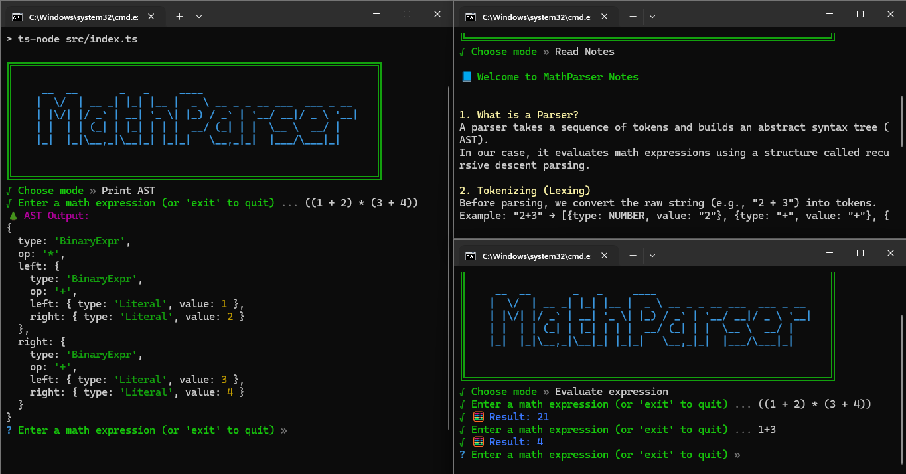

Math Expression Parser & Interpreter (CLI-Based)

A fully interactive command-line tool written in **TypeScript** that demonstrates how simple **interpreters** parse and evaluate math expressions. It breaks down how compilers and interpreters work under the hood, step-by-step, from tokenizing raw text to parsing it into structured trees and finally evaluating results.

---



---

## Features

- **Lexer (Tokenizer)**  
  Converts raw text input into recognizable tokens like `NUMBER`, `+`, `*`, `(`, and `)`.

- **Recursive Descent Parser**  
  Uses a handcrafted parser implementing methods like `parseExpr`, `parseTerm`, and `parseFactor`, respecting operator precedence and parentheses.

- **Interpreter / Evaluator**  
  Traverses the parsed structure to compute the final result.

- **AST Printing Mode**  
  Outputs a fully structured Abstract Syntax Tree for advanced visualization of how the parser groups expressions.

- **Notes / Learning Mode**  
  Shows simple but helpful content that teaches:
  - Lexing vs parsing
  - Abstract Syntax Trees (ASTs)
  - Precedence & associativity
  - Recursive parsing principles

- **ASCII Art CLI Interface**  
  Polished user experience with:
  - ASCII logo banner
  - Colorful styled output using `chalk`
  - Animated loading using `ora`
  - Interactive prompts using `prompts`
  - Framed output using `boxen`

---

## 🛠 Tech Stack

- **Node.js**
- **TypeScript**
- `chalk` – color formatting  
- `prompts` – for interactive user input  
- `boxen` – for box-style CLI banners  
- `ora` – spinner animations
- `jest` - testing
- `prettier` - code formatting
- `husky` - for pre-commits

---

## Getting Started

```bash
git clone https://github.com/Lymore01/math-parser.git
cd math-parser
npm install
npm run dev   # or ts-node src/index.ts
```